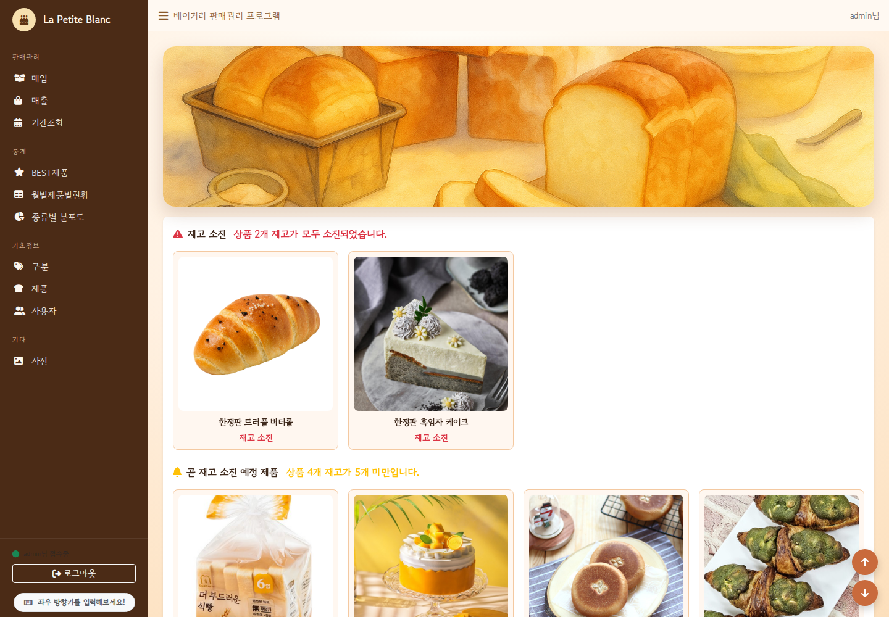
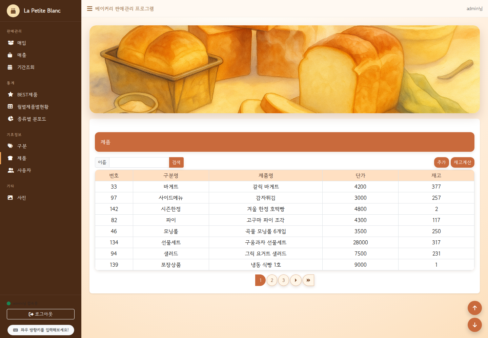
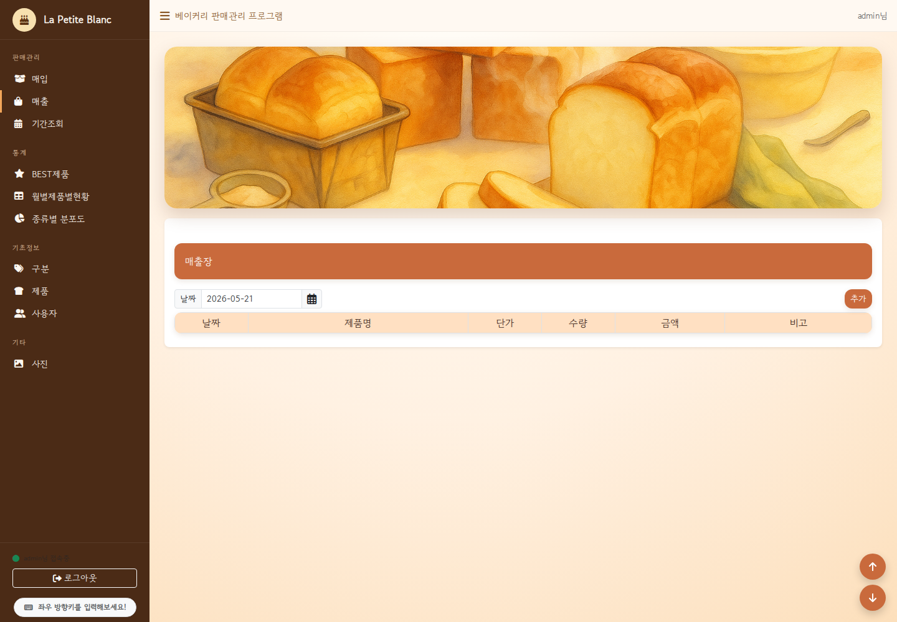
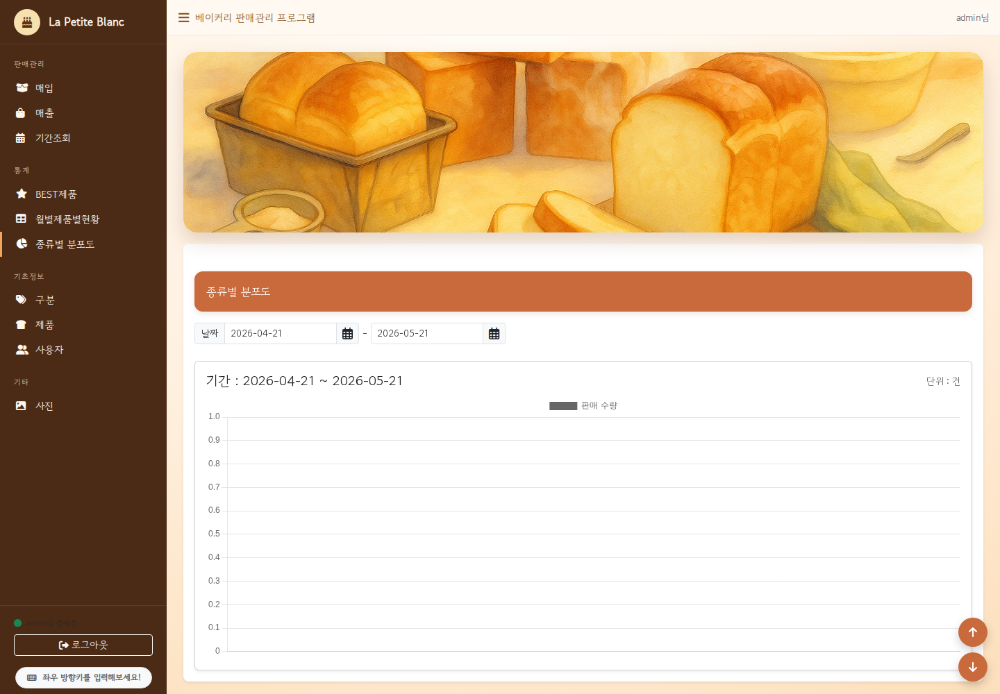

# Bakery Sales Management Laravel

Laravel 기반 베이커리 매입/매출 및 재고 관리 애플리케이션입니다. 상품/구분 관리, 매입/매출 장부, 기간별 거래 조회, 재고 계산, BEST 상품, 월별 상품 현황, 종류별 차트, 상품 이미지 목록, 사용자 권한 관리를 구현했습니다.

## 기술 스택

- PHP 8.2 이상
- Laravel 12
- MySQL 또는 MariaDB
- Blade Template
- Bootstrap 5
- jQuery
- Chart.js
- PhpSpreadsheet

## 구현 의도

소규모 베이커리 매장의 상품, 입출고, 매출 통계를 한 화면 흐름 안에서 관리할 수 있도록 구성했습니다. 학습용 CRUD 예제에서 끝나지 않도록 로그인 기반 접근 제어, 관리자 권한 분리, 이미지 업로드 검증, 샘플 데이터 정리까지 포함해 GitHub 포트폴리오로 확인하기 좋은 형태를 목표로 했습니다.

## 담당 구현

- Laravel MVC 구조 기반 상품, 구분, 장부, 회원 관리 기능 구현
- 매입/매출 데이터를 활용한 재고 계산 및 기간별 조회 구현
- BEST 상품, 월별 판매 현황, 종류별 판매 분포 차트 구현
- 상품 이미지 업로드, 목록 조회, storage link 기반 이미지 제공 구현
- 세션 기반 로그인/로그아웃, 관리자 권한 메뉴 및 라우트 보호 정리
- 샘플 DB와 README를 포트폴리오 공개용으로 정리

## 주요 기능

- 로그인/로그아웃 및 사용자 등급 기반 메뉴 노출
- 상품 구분 CRUD
- 상품 CRUD 및 이미지 업로드
- 매입/매출 장부 CRUD
- 기간별 거래 조회 및 Excel 다운로드
- 재고 계산
- BEST 상품 조회
- 월별 상품별 판매 현황
- 종류별 판매 분포 차트
- 재고 소진/재고 부족 상품 대시보드

## 주요 테이블 구조

```text
members   사용자 계정, 비밀번호, 이름, 연락처, 권한 등급
gubuns    상품 구분 정보
products  상품명, 구분, 가격, 재고, 이미지 파일명
jangbus   매입/매출 구분, 거래일, 상품, 수량, 금액, 비고
```

## 화면 미리보기

스크린샷은 `docs/images/` 경로 기준으로 정리합니다.






## 실행 방법

```bash
composer install
npm install
cp .env.example .env
php artisan key:generate
```

`.env`의 DB 설정을 로컬 환경에 맞게 수정합니다.

```env
DB_CONNECTION=mysql
DB_HOST=127.0.0.1
DB_PORT=3306
DB_DATABASE=sale7
DB_USERNAME=root
DB_PASSWORD=
```

샘플 DB를 가져옵니다.

```bash
mysql -u root -p < database/sale7.sql
```

상품 이미지가 보이도록 storage link를 생성합니다.

```bash
php artisan storage:link
```

개발 서버를 실행합니다.

```bash
php artisan serve
```

브라우저에서 접속합니다.

```text
http://localhost:8000
```

## 샘플 로그인

```text
관리자 ID: admin
관리자 PW: 1234

직원 ID: staff01
직원 PW: 1234
```

## GitHub 업로드 전 확인 사항

- `.env`는 업로드하지 않습니다.
- `vendor`는 업로드하지 않습니다. `composer install`로 복구합니다.
- `node_modules`는 업로드하지 않습니다. `npm install`로 복구합니다.
- `public/storage`는 업로드하지 않습니다. `php artisan storage:link`로 생성합니다.
- 샘플 DB는 `database/sale7.sql`에 포함되어 있습니다.

## 프로젝트 구조

```text
app/Http/Controllers    주요 컨트롤러
app/Http/Middleware     로그인 및 관리자 접근 제어
app/Models              Eloquent 모델
resources/views         Blade 화면
routes/web.php          웹 라우트
public/my               CSS, JS, 이미지 정적 리소스
storage/app/public      상품 이미지 샘플 데이터
database/sale7.sql      샘플 DB 스크립트
docs/images             README 화면 미리보기 이미지 경로
```

## 추천 저장소 정보

```text
Repository name: bakery-sales-management-laravel
Description: Laravel based bakery sales and inventory management application
Topics: laravel, bakery, sales-management, inventory-management, mysql
```
